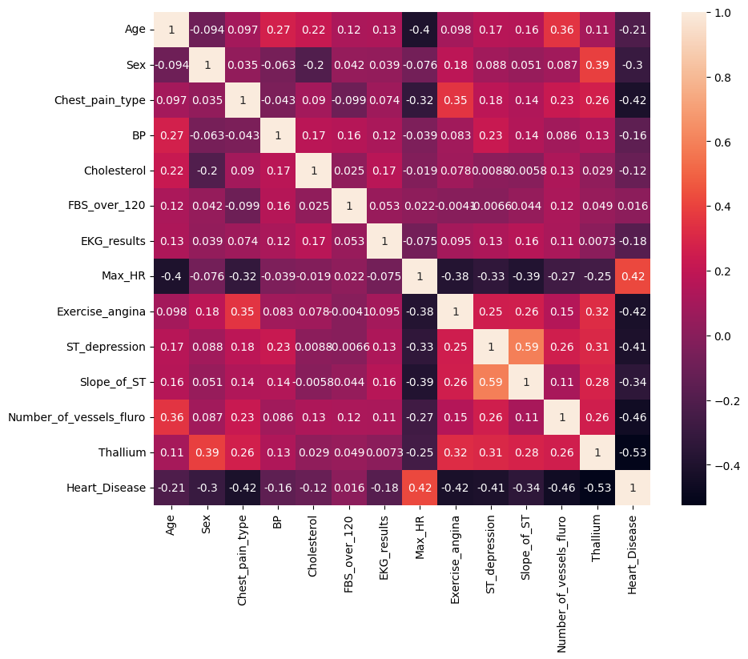
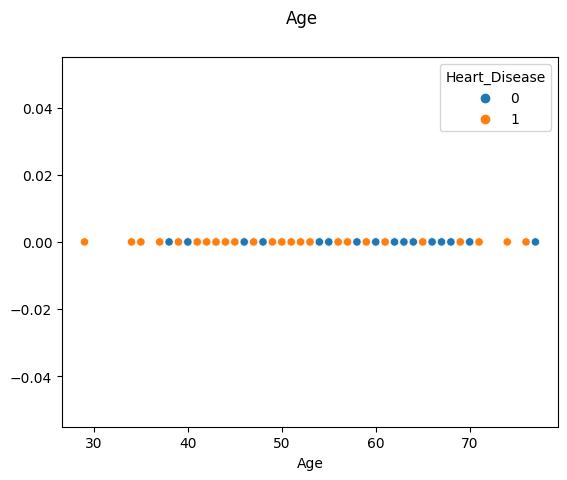
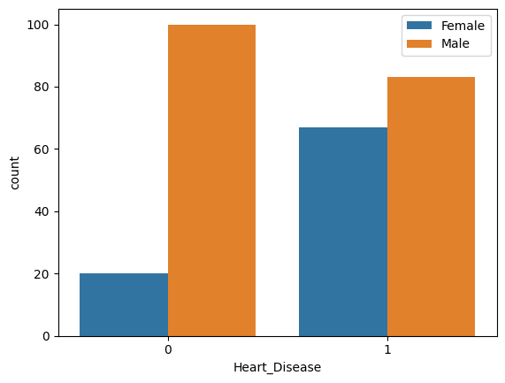
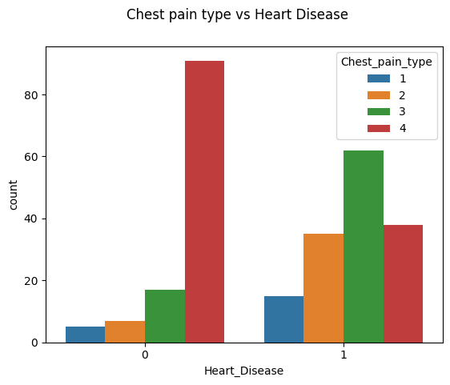
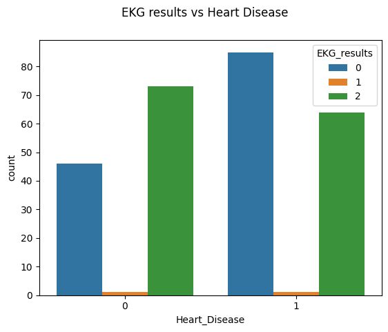
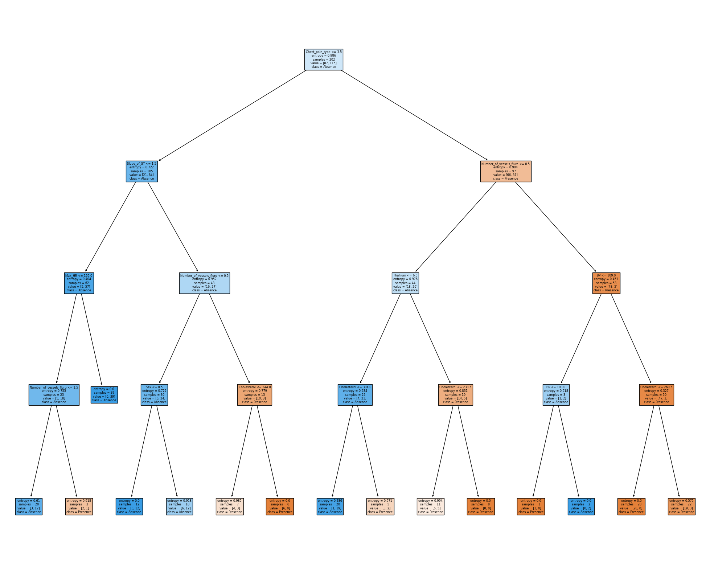

# Laporan Proyek Machine Learning

### Nama : Aditya Budiansyah

### Nim : 211351004

### Kelas : Pagi B

## Domain Proyek

Data ini mencakup berbagai informasi terkait kondisi penderita penyakit jantung. Informasi ini dapat berperan sebagai petunjuk untuk menentukan adanya kondisi yang serupa yang dialami oleh semua individu yang menderita penyakit jantung.

## Business Understanding

Perkiraan ini dapat memberikan wawasan dan pengetahuan tentang tanda atau karakteristik yang sama yang dimiliki oleh individu yang menderita penyakit jantung.

Bagian laporan ini mencakup:

### Problem Statements

Menjelaskan pernyataan masalah latar belakang:

- Terdapat banyak orang yang menderita penyakit jantung tetapi minimnya penyebaran informasi tentang penyebab dan tanda-tanda yang mungkin menunjukkan adanya penyakit jantung.

### Goals

Menjelaskan tujuan dari pernyataan masalah:

- Untuk mengedukasi masyarakat tentang beberapa tanda atau kondisi yang berpotensi terkait penyakit jantung, dengan tujuan agar kesadaran mengenai penyakit jantung dapat ditingkatkan sejak dini di kalangan masyarakat.

Semua poin di atas harus diuraikan dengan jelas. Anda bebas menuliskan berapa pernyataan masalah dan juga goals yang diinginkan.

### Solution statements

- Platform pengembangan berdasarkan data survei kondisi beberapa penderita penyakit jantung menyajikan sejumlah indikator seperti tekanan darah, kadar gula darah, kadar kolesterol, dan lain-lain. Hal ini bertujuan untuk menyimpulkan pola-pola yang serupa dalam kondisi yang diderita oleh penderita penyakit jantung. Indikator-indikator yang disurvei memiliki potensi untuk menjadi pemicu penyakit jantung dan upaya disosialisasikan kepada masyarakat agar dapat mengenali gejala sedari dini melalui indikator-indikator yang terdapat dalam platform.
- Model yang dihasillkan dari datasets ini menggunakan metode Dtree.

## Data Understanding

Beberapa faktor yang diyakini memiliki peran dalam menyebabkan penyakit jantung meliputi tekanan darah, kadar gula darah, kadar kolesterol, dan detak jantung. Faktor-faktor ini dapat digunakan untuk memprediksi apakah seseorang yang memiliki indikator-indikator tersebut mengidap penyakit jantung atau tidak.

[Heart Disease Prediction](https://www.kaggle.com/datasets/rishidamarla/heart-disease-prediction).

Selanjutnya menguraikan seluruh variabel atau fitur pada data

### Variabel-variabel pada Global Video Game Sales adalah sebagai berikut:

- Age : menunjukkan usia (int64)
- Sex : menunjukkan jenis kelamin (int64)
- Chest pain type : menunjukkan jenis nyeri dada (int64)
- BP : menunjukkan tekanan darah (int64)
- Cholesterol: menunjukkan kolestrol (int64)
- FBS over 120 : menunjukkan gula darah (int64)
- EKG results : menunjukkan hasil elektrokardiografi (int64)
- Max HR : menunjukkan detak jantung maksimum (int64)
- Exercise angina : menunjukkan angina akibat olahraga (int64)
- ST depression : menunjukkan ST depression (int64)
- Slope of ST : menunjukkan kemiringan puncak latihan segmen ST (int64)
- Number of vessels : Menunjukkan jumlah pembuluh besar (int64)
- Thallium : menunjukkan 0 = biasa; 1 = cacat tetap; 2 = cacat yang dapat dibalik (int64)
- target : menunjukkan mengacu pada adanya penyakit jantung pada pasien. Bernilai bilangan bulat 0 = sakit dan 1 = tidak ada penyakit
  (int64)

## Data Preparation

## Data Collection

Untuk data collection ini, saya mendapatkan dataset yang nantinya digunakan dari website kaggle dengan nama dataset Heart Disease

## Import dataset

Karena kita menggunakan google colab untuk mengerjakannya maka kita akan import files

```bash
from google.colab import files
```

Lalu mengupload token kaggle agar nanti bisa mendownload sebuah dataset dari kaggle melalui google colab

```bash
file.upload()
```

Setelah mengupload filenya, maka kita akan lanjut dengan membuat sebuah folder untuk menyimpan file kaggle.json yang sudah diupload tadi

```bash
!mkdir -p ~/.kaggle
!cp kaggle.json ~/.kaggle/
!chmod 600 ~/.kaggle/kaggle.json
!ls ~/.kaggle
```

lalu mari kita download datasetsnya

```bash
!kaggle datasets download -d rishidamarla/heart-disease-prediction
```

Selanjutnya kita harus extract file yang tadi telah didownload

```bash
!mkdir heart-disease-prediction
!unzip heart-disease-prediction -d heart-disease-prediction
!ls heart-disease-prediction
```

## Library yang digunakan

```bash
import pandas as pd
import numpy as np
import seaborn as sns
import matplotlib.pyplot as plt
from sklearn.model_selection import train_test_split
from sklearn.metrics import accuracy_score, confusion_matrix, classification_report
from sklearn.tree import DecisionTreeClassifier
from sklearn import tree
```

## Data discovery

Mari lanjut dengan memasukkan file csv yang telah diextract pada sebuah variable, dan melihat 5 data paling atas dari datasetsnya

```bash
df = pd.read_csv('heart-disease-prediction/Heart_Disease_Prediction.csv')
df.head()
```

Untuk melihat mengenai type data dari masing masing kolom kita bisa menggunakan property info,

```bash
df.info()
```

ringkasan statistik deskriptif dari DataFrame

```bash
df.describe()
```

menampilkan dimensi dari DataFrame, yaitu jumlah baris dan kolomnya

```bash
df.shape
```

menghitung jumlah kemunculan setiap nilai yang ada dalam kolom 'Heart_Disease' dalam DataFrame df.

```bash
df['Heart_Disease'].value_counts()
```
disini belum bisa jalan karna kita proesing dulu di bagian preprocessing merubah nama pada kolom 'Heart Disease'

## EDA

Mari kita lanjut dengan data exploration kita,

```bash
plt.figure(figsize=(10,8))
sns.heatmap(df.corr(),annot=True)
```

 <br>

Menampilkan kolom age

```bash
plt.suptitle("Age")
sns.scatterplot(data=df, x='Age', y=np.zeros(len(df['Age'])), hue=df['Heart_Disease'])
plt.show()
```



Menunjukkan jumlah pengamatan untuk setiap kategori dalam kolom 'Heart_Disease', dengan pembagian berdasarkan jenis kelamin ('Sex').

```bash
ax = sns.countplot(x='Heart_Disease', hue='Sex', data=df)
legend_labels, _= ax.get_legend_handles_labels()
ax.legend(legend_labels, ['Female','Male'], bbox_to_anchor=(1,1))
plt.show()
```



Membandingkan jumlah pengamatan (count) untuk setiap kombinasi jenis nyeri dada ('Chest_pain_type') dengan kehadiran atau ketiadaan penyakit jantung ('Heart_Disease') dalam DataFrame df.

```bash
plt.suptitle('Chest pain type vs Heart Disease')
sns.countplot(data=df, x='Heart_Disease', hue='Chest_pain_type')
plt.show()
```



Membandingkan jumlah pengamatan (count) untuk setiap kombinasi hasil elektrokardiogram (EKG) ('EKG_results') dengan kehadiran atau ketiadaan penyakit jantung ('Heart_Disease') dalam DataFrame df.

```bash
plt.suptitle('EKG results vs Heart Disease')
sns.countplot(data=df, x='Heart_Disease', hue='EKG_results')
plt.show()
```



## Preprocessing

Merubah nama data pada kolom di dataframe

```bash
df = df.rename(columns={'Chest pain type': 'Chest_pain_type', 'FBS over 120': 'FBS_over_120', 'EKG results': 'EKG_results', 'Max HR': 'Max_HR', 'Exercise angina': 'Exercise_angina', 'ST depression': 'ST_depression', 'Slope of ST': 'Slope_of_ST', 'Number of vessels fluro': 'Number_of_vessels_fluro', 'Heart Disease': 'Heart_Disease'})
print("\nDataframe setelah perubahan:")
print(df.dtypes)
```

Merubah isi pada setiap kolom Heart_disease menjadi 0 dan 1

```bash
df['Heart_Disease'] = df['Heart_Disease'].replace({'Presence': 0, 'Absence': 1})

print("\nDataFrame setelah perubahan:")
print(df)
```

merubah tipe data pada kolom ST_depression dan Heart_disease menjadi integer

```bash
df['ST_depression'] = df['ST_depression'].astype('int64')
df['Heart_Disease'] = df['Heart_Disease'].astype('int64')
print("\nTipe data setelah perubahan:")
print(df.dtypes)
```

Mengecek kolom kosong pada dataframe

```bash
df.isna().sum()
```

Mengecek kolom kosong pada dataframe

```bash
df.to_csv('Heart-Disease-Prediction.csv')
```

## Modeling

Langkah pertama adalah memasukkan kolom-kolom fitur yang ada di datasets dan juga kolom targetnya,

```bash
ind_col = [col for col in df.columns if col != 'Heart_Disease']
dep_col = 'Heart_Disease'
```

Melihat isi dalam kolom label

```bash
df[dep_col].value_counts()
```

Nilai x untuk features dan nilai y untuk label

```bash
x = df[ind_col]
y = df[dep_col]
```

Selanjutnya kita akan menentukan berapa persen dari datasets yang akan digunakan untuk test dan untuk train

```bash
x_train, x_test, y_train, y_test = train_test_split(x,y,random_state=70)
```

lalu membuat mode dan memasukkan X_train dan y_train pada model dan melihat score serta evaluasi f1 score

```bash
dtc = DecisionTreeClassifier(
    ccp_alpha=0.0, class_weight=None, criterion='entropy',
    max_depth=4, max_features=None, max_leaf_nodes=None,
    min_impurity_decrease=0.0, min_samples_leaf=1,
    min_samples_split=2, min_weight_fraction_leaf=0.0,
    random_state=42, splitter='best'
)

model = dtc.fit(x_train, y_train)

dtc_acc = accuracy_score(y_test, dtc.predict(x_test))

print(f"akurasi data training = {accuracy_score(y_train, dtc.predict(x_train))}")
print(f"akurasi data testing = {dtc_acc} \n")

print(f"confusion matrix : \n {confusion_matrix(y_test, dtc.predict(x_test))}\n")
confusion = confusion_matrix(y_test, dtc.predict(x_test))
tn,fp,fn,tp = confusion.ravel()
print(f"classification report : \n {classification_report(y_test, dtc.predict(x_test))}")
```

Berahasil mendapatkan score 0.8529411764705882

Mari kita coba simulasi prediksi dengan Dtree

```bash
input_data = (70,1,4,130,322,0,2,109,0,2.4,2,3,3)

input_data_as_numpy_array = np.array(input_data)

input_data_reshape = input_data_as_numpy_array.reshape(1,-1)

prediction = model.predict(input_data_reshape)
print(prediction)

if(prediction[0]==0):
  print('Pasien terkena penyakit jantung')
else:
  print('Pasien tidak terkena penyakit jantung')
```

berhasil!!, sekarang modelnya sudah selesai, mari kita export sebagai sav agar nanti bisa kita gunakan pada project web streamlit kita.

## Evaluation

Disini saya menggunakan f1 score sebagai metrik evaluasi.

F1 score adalah metrik evaluasi yang digunakan dalam permasalahan klasifikasi untuk mengukur keseimbangan antara presisi (precision) dan recall. F1 score menggabungkan kedua metrik ini menjadi satu skor tunggal dan berguna ketika keseimbangan antara false positives dan false negatives penting dalam konteks tertentu.

Rumus F1 score adalah:
precision = TP / (TP + FP)
recall = TP / (TP + FN)

f1*score = 2 * (precision \ recall) / (precision + recall)

Setelah itu saya menerapkannya dalam kode menggunakan fungsi f1 score, seperti berikut :

```bash
print(f"classification report : \n {classification_report(y_test, dtc.predict(x_test))}")
```

dan hasil yang saya dapatkan adalah 0.83, itu berarti model ini memiliki keseimbangan yang lumayan baik antara presisi dan recall.

## Visualisasi hasil algoritma

```bash
import matplotlib.pyplot as plt
fig = plt.figure(figsize=(25,20))
_ = tree.plot_tree(model,
                    feature_names=ind_col,
                    class_names=['Presence', 'Absence'],
                    filled=True)
```



## Save model (pickle)

```bash
import pickle

filename = 'heart_disease_prediction.sav'
pickle.dump(dtc,open(filename,'wb'))
```

## Deployment

https://app-heartdiseasedtree-by-aditya-budiansyah.streamlit.app/

##
